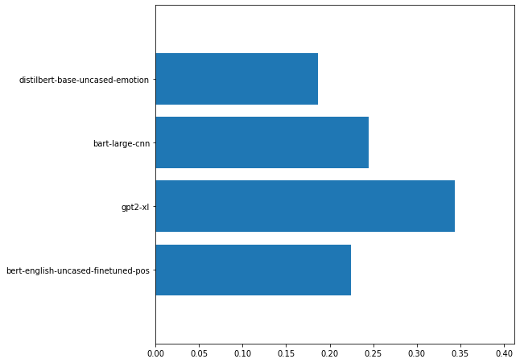
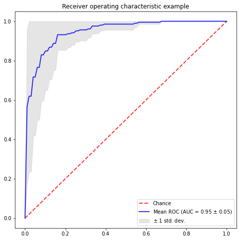
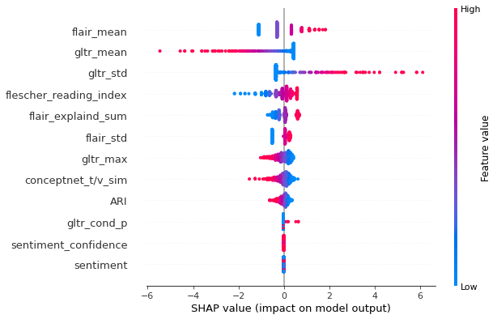

# Literary Metaphor Detection
This project explores literary metaphor detection (Binary classification) and user rating prediction (10 regression targets)
Literary metaphors can be detected on the basis of the 10 user ratings (Jacobs
& Kinder, 2018) provided for the Katz et al.’s 1988 corpus, . The classification section of this projects explores reproducing similar results using automated feature pipelines, both on the word level and on the document level. 
| Method                           | ROC AUC      | # features    |
| -------------------------------- | -------- |-------------|
| Flair GPT2 medium finetuned Classifier  | 0.95 | 1280     |
| Logistic Regression + Transformer Ensembled Embedding      | 0.89| 4160        |
| Lgostic Regression + GPT2--medium-finetuned             |0.85| 1280    |
| Logistic Regression + engineered features | 0.75  | 14    |
-------------------------------------------------
## Project Setup:
The development environment used for this project is Colab-pro. GPT2 finetuning was done on GCP notebooks with v100 GPU and 48 GPU Hours. 

The source code comprises 5 py files:   
    preprocess.py : loads the txt corpus and preprocesses the metaphors   
    utils.py : contains plotting utils     
    featurize.py : contains feature functions and corpus featurizer function    
    classifiers.py : contains different classification and benchmarking models for the datasets    
    GLTR.py : a port for GLTR modified to work with hugging face transformers.   
The main body of the project is in Literary_Metaphor_detection.ipynb notebook

-------------------------------------------------
## Models Overview: 
### Document Embedding models:
These models  use an ensemble of transformer based document embedding to embed the metaphors, then use the concatenated vector to predict the binary target (literary/non-literary)
The ensemble uses transformers fine tuned on different applications, this includes: part-of-speech tagging, language modeling and sentiment classifiaction. The intuition behind this is that finetuned transformers on different task would encompass different semantic features of the metaphors.
The below figure shows the aggregated feature importance for each transformer model by an extremly randomized tree classifier.

### Flair Classifier Model:
This model uses the finetuned GPT2-medium embeddings for the document embeddings, and uses Flair classifier, with a LR scheduler, a batch size of 4, and trains for 10 epochs for each fold. This is the best performing model on the corpus in this project. Below is a plot of the model average AUC and std.

### Word Embedding models:
This models investigate word level features, the features include the word tenor vehicle relation with different embedding models, the cosine similarity between the metaphor words from different embedding models, sentiment and confidence score, ease of readness, and the gltr word statistics. There are 14 features in total which makes this approach explainable. The below figure shows the 

| Method                           | ROC AUC      |
| -------------------------------- | -------- |
| Logistic Regression |0.7448|
| SVM | 0.73| 
| Tabnet| 0.720  |
| Extra Trees | 0.7159 |
| Random Forest | 0.701  | 
| Regularized Greedy Forests| 0.6712  |
| XGBoost | 0.66  |
| K-nn    | 0.66| 

-------------------------------------------------
## Key Insights:
1- Flescher reading index is informative for literary metaphors detection, literary metaphors tend to be less confusing.   
2- Literary metaphors tend to have greater mean embedding distance, which means they spann wider concepts.   
3- Literary metaphors tend to be more surprising for a transformer model   
4- Transformer embeddings can efficiently seperate literary metaphors from non-literary metaphors.

-------------------------------------------------
## References:
Arthur M. Jacobs & Annette Kinder (2018) What makes a metaphor literary? Answers from two computational studies, Metaphor and Symbol, 33:2, 85-100, DOI: 10.1080/10926488.2018.1434943    

Jacobs, A. M., & Kinder, A. (2017). The brain is the prisoner of thought: A machine-learning assisted quantitative
narrative analysis of literary metaphors for use in Neurocognitive Poetics. Metaphor and Symbol, 32(3), 139–160.
doi:10.1080/10926488.2017.1338015

Katz, A., Paivio, A., Marschark, M., & Clark, J. (1988). Norms for 204 literary and 260 non-literary metaphors on
psychological dimensions. Metaphor and Symbolic Activity, 3(4), 191–214.     

Sebastian Gehrmann, Hendrik Strobelt, & Alexander M. Rush. (2019). GLTR: Statistical Detection and Visualization of Generated Text.

Akbik, A., Blythe, D., & Vollgraf, R. (2018). Contextual String Embeddings for Sequence Labeling. In COLING 2018, 27th International Conference on Computational Linguistics (pp. 1638–1649).

Scott Lundberg, & Su-In Lee. (2017). A Unified Approach to Interpreting Model Predictions.

