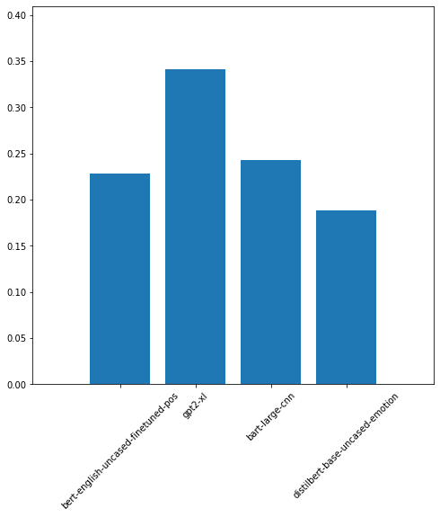
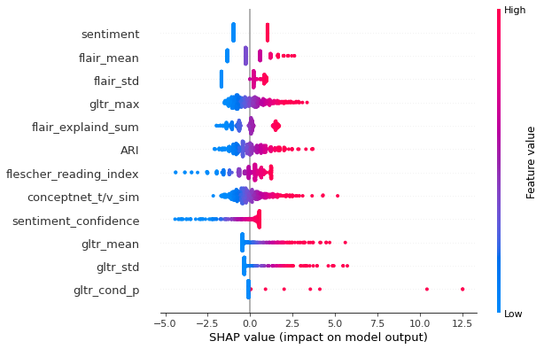

# LiteraryMetaphorDetection
This project explores literary metaphor detection (Binary classification) and user rating prediction (10 regression targets)
Literary metaphors can be detected on the basis of the 10 user ratings in the katz. et al dataset, . The classification section of this projects explores reproducing similar results using automated feature pipelines, both on the word level and on the document level. 
| Method                           | ROC AUC      | # features    |
| -------------------------------- | -------- |-------------|
| Logistic Regression +Transformer Ensembled Embedding              | .89| 4070        |
| GPT2--medium-finetuned                   | .85| 1080    |
| Flair GPT2 Large Classifier  | .97 | 1280     |
| Logistic Regression + engineered features | .75  | 14    |
-------------------------------------------------
## Models Overview: 
### Document Embedding models:
These models  use an ensemble of transformer based document embedding to embed the metaphors, then use the concatenated vector to predict the binary target (literary/non-literary)
The ensemble uses transformers fine tuned on different applications, this includes: part-of-speech tagging, language modeling and sentiment classifiaction. The intuition behind this is that finetuned transformers on different task would encompass different semantic features of the metaphors.
The below figure shows the aggregated feature importance for each transformer model by an extremly randomized tree classifier.

### Word Embedding models:
This models investigate word level features, the features include the word tenor vehicle relation with different embedding models, the cosine similarity between the metaphor words from different embedding models, sentiment and confidence score, ease of readness, and the gltr word statistics. There are 14 features in total which makes this approach explainable.

